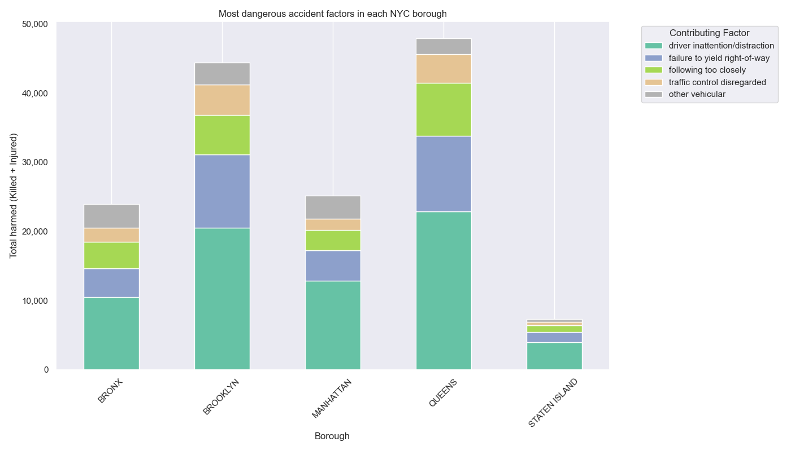
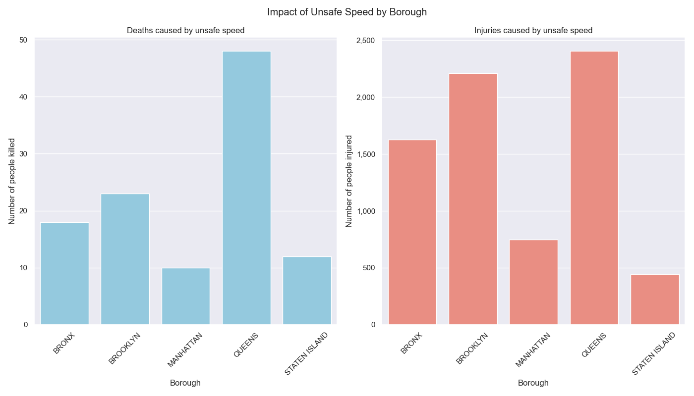
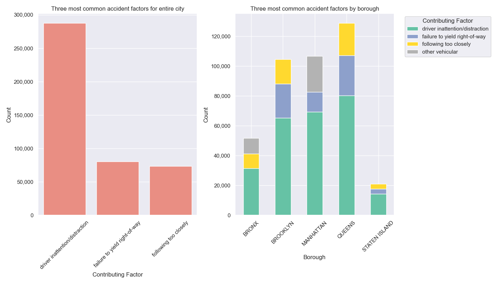
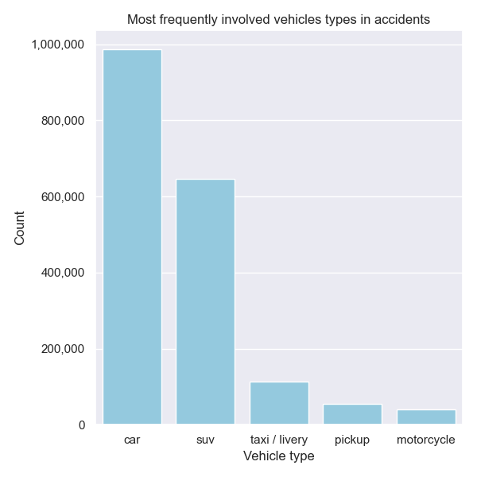
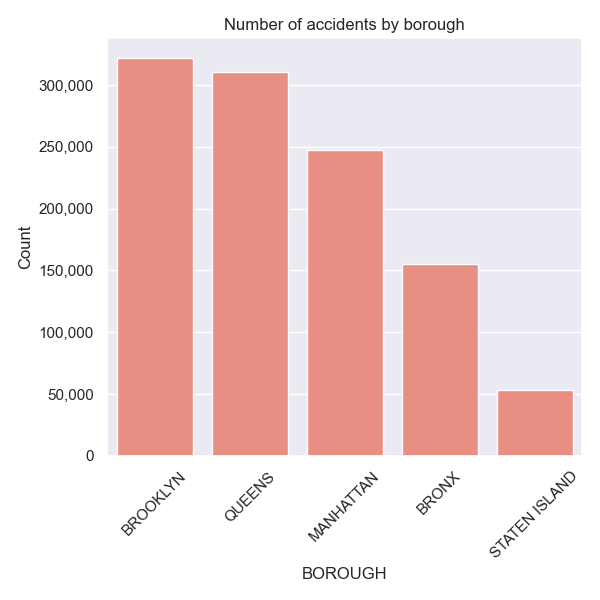

# 📈 NYC Traffic Accident Analysis

---

## Table of contents
* [Key goals](#key-goals)
* [Data description](#data-description)
* [Visuals](#visuals)
* [Tech stack](#tech-stack)
* [Conclusion](#conclusion)

## Key goals: 

- Prepare and clean NYC traffic accident data
- Identify the most dangerous accident factors in each New York borough
- Analyze deaths and injuries caused by speeding across boroughs
- Determine the three most common accident factors by borough and city-wide
- Identify the vehicle types most frequently involved in accidents
- Provide statistics on accident number by borough

---

## Data description

*To be added soon...*

---

## Visuals

### Most dangerous accident factors in each NYC borough

### Impact of unsafe speed by borough

### Three most common accident factors

### Most frequently involved vehicle types

### Number of accidents by borough

---

## Tech stack

**Languages:**
- Python 3.12.1

**Libraries:**
- Pandas – data manipulation and analysis
- NumPy – numerical operations
- Matplotlib – data visualization
- Seaborn – advanced visualizations
- Geopandas – spatial data analysis
- RapidFuzz – string cleaning

**Tools:**
- Jupyter Notebook – development environment
- VS Code – code editor
- Git – version control
- GitHub – code hosting and collaboration

---

## Conclusion

To raise drivers awereness, **New York City** should consider introducing **courses or trainings programs for residents** as lack of attention is a leadingy contributing factor in traffic accidents.

Moreover, **Queens** stands out when it comes to **incidents** caused by **unsafe speed**. The City should improve infrastructure in the borough by installing more **speed bumps** and **increasing speed enforcement** to help prevent further deaths and injuries.

Finally, residents should **exercise extra caution**, when driving through **Brooklyn** and **Queens**, as these are **the most dangerous boroughs** in terms of accident frequency and death rate.
